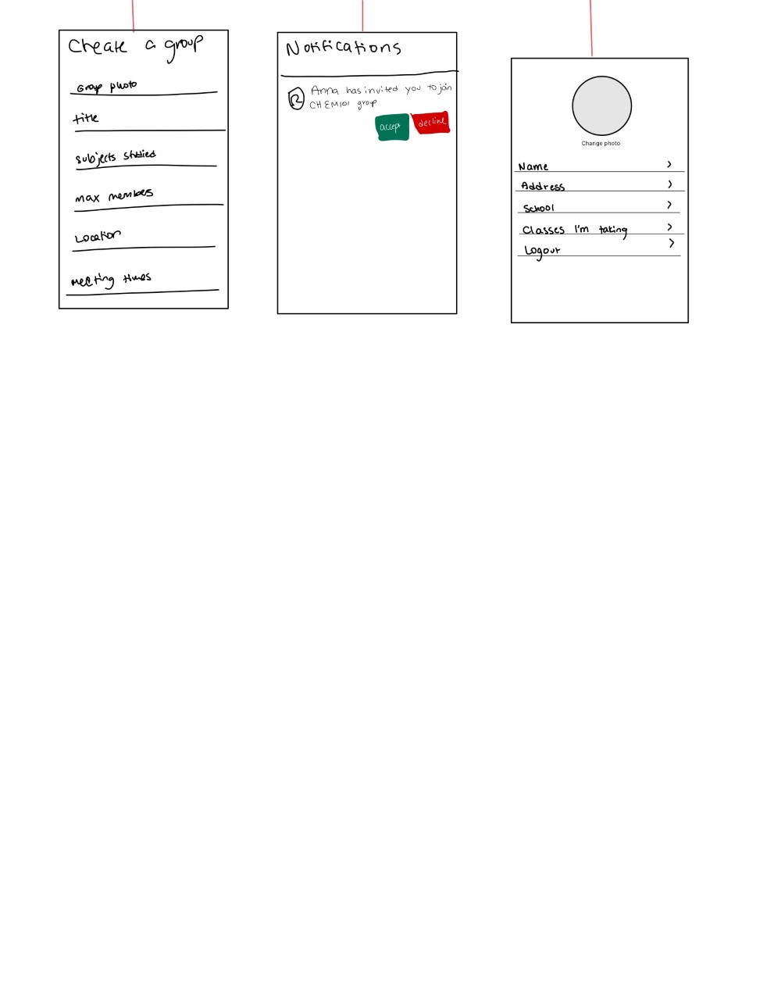

# FBUApp
Original App Design Project - README Template
===

# Swipe and Study

## Table of Contents
1. [Overview](#Overview)
1. [Product Spec](#Product-Spec)
1. [Wireframes](#Wireframes)
2. [Schema](#Schema)

## Overview
### Description
This app makes it easy to for students to find and form study groups that fit their preferences. By swiping through a list of questions/preferences, students can be matched with people on campus or engage in completely virtual study groups based on classes or specific topics that they wish to study. Preferences users will swipe through include location proximity, study material, size of study group, frequency of meetings, study habits. Study groups will contain a shared study resources/chat feature as well as the location of the study group and meeting times.

### App Evaluation
- **Category:** Study Tool
- **Mobile:** Mobile first application
- **Story:** Way to connect students with similar needs in order to simplify the process of forming a study group
- **Market:** Students
- **Habit:** People who like to study collaboratively
- **Scope:** Expand to include tutoring and user profiles with mastered concepts

## Product Spec

### 1. User Stories (Required and Optional)

**Required Must-have Stories**

* User can register a new account and create a profile
* User can login and log out
* User can find a study group by swiping/selecting preferences (Matching process technically challenging)
* User can view a My Groups page to navigate all of his/her study groups
* User can view the page of a specific group containing meeting times, location and resources (Zoom API technically challenging)
* ...

**Optional Nice-to-have Stories**

* User can start by creating a profile containing campus, classes, location and needs
* Study groups can have an admin that can change essential group and admit new people to the group
* User can see a list of recommended study groups to join based on the classes that they are taking and their profiles
* Study groups can be open or closed (If closed, users must request to join and otherwise they will automatically be added if they select join)
* If a user wants to form a group with a specific group of users she/he can do so (Through a create a group feature)
* Users can be invited into a group
* User can view Group resources, chat with members of the group and change the location/meeting times of the group.
* Groups can be custom named
* Groups contains a list of preferences (ex. quiet group, frequent meeting times, level of collaboration)
* Groups contain an About Group page which contains the number of members, the topics being covered, the meeting times, and group preferences
* Group background image will show up when you are looking for groups (if it is on campus, then it will be a picture of the campus)
* General groups (not based on a specific class) have a difficulty level (basic, intermediate, advanced)
* Groups can be discarded after class ends for the user
* At the end of the matching process, users can see their group/people matches (For groups they can click the join button and for people they can select request to form a new group)
* Past groups page exists containing all of the group information
* Group resources are categorized by type (Study Guides, Notes, Youtube Video Links, )
* User can view a calendar and can see only groups that have meeting times that do not conflict

### 2. Screen Archetypes

* Login
   * User logs in to existing account
* Register
   * User registers new account
* Find a Study Group
   * User can find a study group by swiping/selecting preferences
* Stream
   * List of Recommended Groups to Join
* My Groups
    * List of Groups the User is part of
* Creation
    * User can Create a new group and invite members
* Group Details
    * User can see information about a group they are part of
* Group Brief Overview
    * Users can see details about recommended groups or groups they matched with

### 3. Navigation

**Tab Navigation** (Tab to Screen)

* Home
* Create
* Notifications
* My Groups
* Profile

**Flow Navigation** (Screen to Screen)

* Login
   * Home
* Register
   * Home
* Find a Study Group
    * Group Brief Overview
* Stream
    * Group Brief Overview
* My Groups
    * Group Details
* Group Details
    * None (Maybe resources, members and chat page)
* Group Brief Overview
    * None

## Wireframes

### [BONUS] Digital Wireframes & Mockups

### [BONUS] Interactive Prototype

## Schema 
[This section will be completed in Unit 9]
### Models
#### Group

| Property    | Type                        | Description                                         |
| ----------- | --------------------------- | --------------------------------------------------- |
| objectID    | String                      | unique id for the user post (default field)         |
| name.       | String.                     | Group name to be displayed                          |
| image       | File                        | Background Image for Group                          |
| description | String                      | Group description by members                        |
| joinCount   | Number                      | Number of people who have joined the group          |
| passCount   | Number                      | Number of people who have passed on the group       |
| members     | Array                       | List of User objectIDs who are in the group           |
| topics      | Array                       | List of strings that describe what the group studies |
| location    | String                      | Meeting location of group                           |
| time        | DateTime                    | Group Meeting Time                                  |
| resources   | Pointer to resources object | Group resources                                     |

#### User

| Property  | Type   | Description                                         |
| --------- | ------ | --------------------------------------------------- |
| objectID  | String | unique id for the user (default field)         |
| image     | File   | Profile Image for Group                             |
| schoolID  | String | ID of School                                        |
| groups    | Array  | objectIDs of User's groups
| location | String? | location of user       |
| classes   | Array  | List of User classes        |

#### Resources
| Property  | Type   | Description                                         |
| --------- | ------ | --------------------------------------------------- |
| objectID  | String | unique id for the user (default field)         |
| Videos     | Array   | Links to YouTube Videos                            |
| Images  | Files Array | Relavant Images                               |
| Links | String Array | List of important links         |
| Files | File Array | List of files      |

#### Location
| Property  | Type   | Description                                         |
| --------- | ------ | --------------------------------------------------- |
| objectID  | String | unique id for the user (default field)              |
| placeID   | String | Place ID of location                                |
| placeName | String | Name of place as a string to display to user        |

### Networking
- [Add list of network requests by screen ]
- [Create basic snippets for each Parse network request]
- [OPTIONAL: List endpoints if using existing API such as Yelp]

* Home Feed Screen
    * (Read/GET) Query all recommended groups
    * (Create/POST) Create a new join on a post
* My Groups Screen
    * (Read/GET) Query all posts where that user is part of
    * (Create/POST) Create a new group
    * (Delete) Leave an existing group
* Match Group Screen
    * (Read/Get) Query all posts that match the user preferences
    * (Create/POST) User can join a new group
* Profile Screen
    * (Read/GET) Query logged in user object
    * (Update/PUT) Update user profile image

